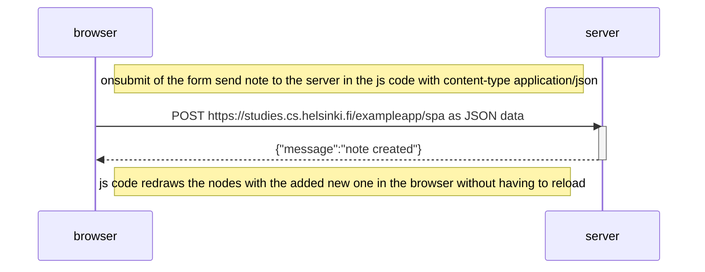

```mermaid
sequenceDiagram
  participant browser
  participant server
  
  Note right of browser: onsubmit of the form send note to the server in the js code with content-type application/json

  browser->>server: POST https://studies.cs.helsinki.fi/exampleapp/spa as JSON data
  activate server
  server-->>browser: {"message":"note created"}
  deactivate server

  Note right of browser: js code redraws the nodes with the added new one in the browser without having to reload
```
